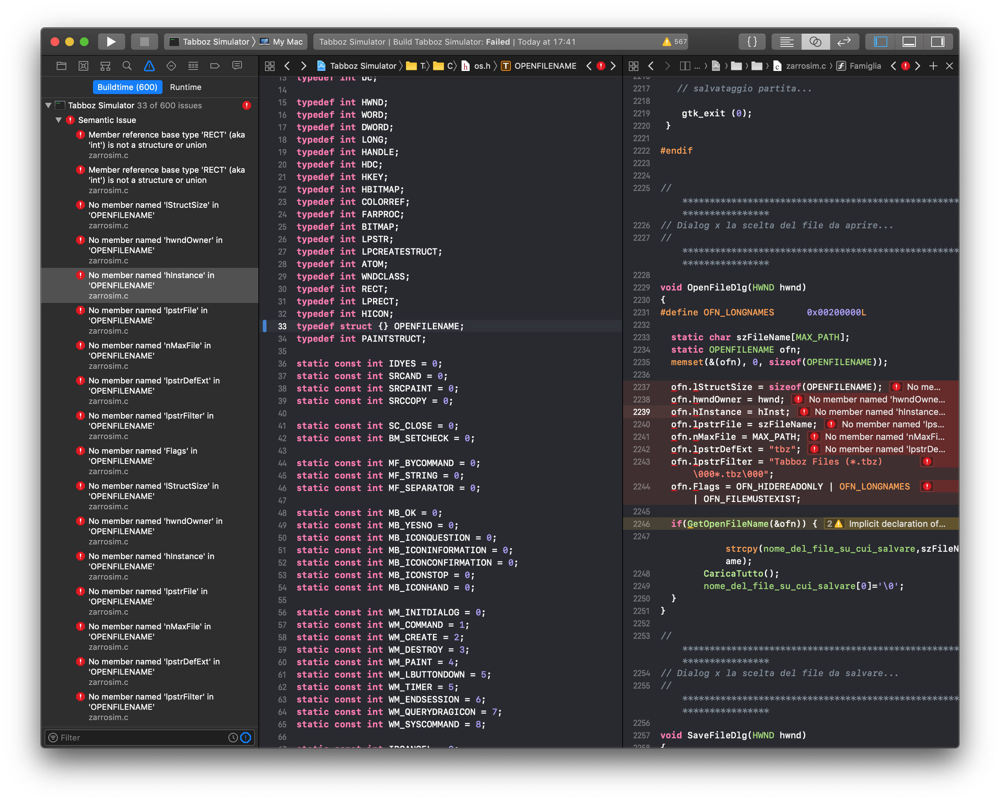

# Building The Legacy Codebase

## Takeoff! Clone and first impressions

Lets clone our upstream repository and take a look at what we're working
with.

    willy@Thala  ~$ git clone https://github.com/andreax79/tabboz.git
    Cloning into 'tabboz'...
    remote: Enumerating objects: 70, done.
    remote: Total 70 (delta 0), reused 0 (delta 0), pack-reused 70
    Unpacking objects: 100% (70/70), done.
    willy@Thala  ~$ cd tabboz/
    willy@Thala  tabboz master$ ls
    BWCC.DLL      lavoro.c      tabimg.c      tabs0402.wav  tabs1300.wav
    BWCC32.DLL    net.c         tabs0000.wav  tabs0501.wav  tabs1500.wav
    LICENSE       net.h         tabs0101.wav  tabs0502.wav  tabs1501.wav
    README.md     newproteggi.c tabs0102.wav  tabs0503.wav  telefono.c
    REGIS32.DSW   obsolete      tabs0201.wav  tabs0504.wav  tempo.c
    TABBOZ.DSW    os.h          tabs0202.wav  tabs0602.wav  tipa.c
    TABBOZ.IDE    prompt.c      tabs0203.wav  tabs0603.wav  vestiti.c
    TEXT.RES      proteggi.c    tabs0204.wav  tabs0604.wav  zarrosim.c
    ZARRO32.RES   readkey.c     tabs0205.wav  tabs0701.wav  zarrosim.def
    bwcc.lib      resource.h    tabs0302.wav  tabs0801.wav  zarrosim.h
    bwcc32.lib    scooter.c     tabs0303.wav  tabs0900.wav
    disco.c       scuola.c      tabs0304.wav  tabs1100.wav
    eventi.c      tabboz.exe    tabs0305.wav  tabs1200.wav
    willy@Thala  tabboz master$ 

This codebase is "deceivefully" well written, so much that I would like
to underline a few of its positive features, while disclosing -- not that
it would matter -- that I do not personally now the original author.

Squinting in what at first glance might see a lazy dump of all files in
no particular order, we might find the usual suspects of an application:

  * a binary build
  * distribution files (README, LICENSE, et similia)
  * build system support files
  * platform support source files
  * application source files
  * resources

There are some features that warrant highlighting. We can easily discern
by the filename alone between the support source files and the familiar
scenarios of the game. And if, as I suspect, you're oblivious to obscure
Italian pop-trash references, can easily serve as a description of
what kind of tamagotchi game we are talking about.

  * `Tabboz`, `Zarro` Being impartial, I will only quote the current Urban
    Dictionary definition:

    > The zarro, always uneducated, impolite and probably a fan
    > of soccer/football, loves to drive a scooter and goes around
    > with other zarri making noise, smoking pot and looking for
    > cocaine.

  * `disco.c` Club
  * `eventi.c` Events
  * `lavoro.c` Job
  * `scooter.c`
  * `scuola.c` School
  * `telefono.c` Mobile
  * `tempo.c` Time
  * `tipa.c` Girlfriend
  * `vestiti.c` Clothing

As you can see, not only we are in for a treat, but let's look at how
much did we gather from a single directory listing that easily fits a
standard terminal. The structure of the distribution, what files contains
which business logic, a small synopsis of the domain model of the
application.

A notable absent is any mention of "middleware" platforms, and no
mention of a "patternized" architecture, suggesting the author chose its
targeting platform wisely, and used it directly for his implementation,
substantially reducing the amount of code to maintain for him, and to
understand for us.

In case you only speak English, my reader friend, let me tell you you are
missing an entire universe of funny holy wars about when, how and why
use what language for what filename, function or variable name, ask your
nearest multi-lingual coder friend about it!

## Tools of the trade, and plan of action

Some disagree, but I belive that the advantages of using an IDE fairly
outweight the lack of "integration" of using separate tools, especially
in a code refactoring excercise like the one at hand, in which we'll have
to quickly wrangle the creation of a build system, bridging between two
languages, and troubleshooting building and linking errors.

The obvious choice falls on the first-party Xcode, which is excellent and
free. With excuses to people who not have access to Xcode, but the
knowledge required to troubleshoot an installation of a Swift runtime
can overlap to the knowledge of translating what the IDE will do under
the hood.

So, let's finally begin for real by addressing one of the elephants in the
room. This is a Windows application, I do not have access to a runtime
to test the build, nor a build environment to try and build the default
configuration.

This might be a crazy idea, but a cursory look at the files show that
the content of the files look exactly like their directory structure:
very well made, very understandable, no "middleman" layers of
abstractions, again a testament of how much simplicity always pays off,
and kind of a lost art, as one would cynically say.

For now, we can envision a fuzzy goal of a text based version of the game,
or maybe a more generic abstraction of the game logic, written somewhat
in Swift.

If that's the fuzzy goal, our first plan is almost forced: we need to get
the codebase to compile, maybe link, with any means necessary. Then,
optimistically, future us will be closer to a fuzzy goal.

## Project Scaffolding

It is good form, if overkill for this exercise, also because upstream
looks like a "dead" dumped artifact, so:

    willy@Thala  tabboz master$ git tag original

It is a Swift naming convention that namespaces like `class`, `struct`,
and `enum` are capitalized, so I believe it follows that other namespaces
like files and directories should be named accordingly.

This means we're going to change the directory structure that's served
so well in all those years to something that's more conventional in its
new home.

Let's archive it in a folder and keep it there as a source to cherry-pick
the files we will use.

    willy@Thala  tabboz master$ mkdir Original
    willy@Thala  tabboz master$ mv * Original/
    willy@Thala  tabboz master$ git add .
    willy@Thala  tabboz master$ git commit -m'Archiving original source'

Finally opening Xcode, let's create a new project: macOS, Command Line Tool
will do just fine for now.

    willy@Thala  tabboz master$ git commit -m'Adding Xcode project'
    [master 9d51fee] Adding Xcode project
     4 files changed, 315 insertions(+)
     create mode 100644 Tabboz Simulator.xcodeproj/project.pbxproj
     create mode 100644 Tabboz Simulator.xcodeproj/project.xcworkspace/contents.xcworkspacedata
     create mode 100644 Tabboz Simulator.xcodeproj/project.xcworkspace/xcshareddata/IDEWorkspaceChecks.plist
     create mode 100644 Tabboz Simulator/main.swift
    willy@Thala  tabboz master$ 

And here's a familiar starting point, our default Hello World template.

As the last "administration" task, let's fork the original upstream repo
and do all the favorite git gymnastic, and pronto, we can push to our
forked repo.

    willy@Thala  tabboz master$ git push
    Counting objects: 2, done.
    Delta compression using up to 8 threads.
    Compressing objects: 100% (2/2), done.
    Writing objects: 100% (2/2), 239 bytes | 239.00 KiB/s, done.
    Total 2 (delta 1), reused 0 (delta 0)
    remote: Resolving deltas: 100% (1/1), completed with 1 local object.
    To https://github.com/biappi/Tabboz-Simulator.git
       f0c4b93..420c8e0  master -> master
    willy@Thala  tabboz master$ git lg

This, of course, means that the repository I am going to work with is
going to be at: https://github.com/biappi/Tabboz-Simulator

## Importing the C Files

In Xcode import a C implementation file into a group, this is one way to
create a bridging header.

From the point of view of a C programmer, this header is a C file the
resulting object will be part of an imaginary translation unit spanning
the entire Swift program. For a Swift programmer, it is the file used to
import C and Objective-C libraries to be used in Swift.

I will continue mechanically importing all the C files in Xcode, resisting
the temptation of cherry-picking only the business-logic files, as this
will present to the Xcode indexer a better view of the code.

    willy@Thala  tabboz master$ git commit -am'Adding C files'
    [master 83cda99] Adding C files
     22 files changed, 9125 insertions(+)
     create mode 100644 Tabboz Simulator/C/Tabboz Simulator-Bridging-Header.h
     create mode 100644 Tabboz Simulator/C/disco.c
     create mode 100644 Tabboz Simulator/C/eventi.c
     create mode 100644 Tabboz Simulator/C/lavoro.c
     create mode 100644 Tabboz Simulator/C/net.c
     create mode 100644 Tabboz Simulator/C/net.h
     create mode 100644 Tabboz Simulator/C/newproteggi.c
     create mode 100644 Tabboz Simulator/C/os.h
     create mode 100644 Tabboz Simulator/C/prompt.c
     create mode 100644 Tabboz Simulator/C/proteggi.c
     create mode 100644 Tabboz Simulator/C/readkey.c
     create mode 100644 Tabboz Simulator/C/resource.h
     create mode 100644 Tabboz Simulator/C/scooter.c
     create mode 100644 Tabboz Simulator/C/scuola.c
     create mode 100644 Tabboz Simulator/C/tabimg.c
     create mode 100644 Tabboz Simulator/C/telefono.c
     create mode 100644 Tabboz Simulator/C/tempo.c
     create mode 100644 Tabboz Simulator/C/tipa.c
     create mode 100644 Tabboz Simulator/C/vestiti.c
     create mode 100644 Tabboz Simulator/C/zarrosim.c
     create mode 100644 Tabboz Simulator/C/zarrosim.h
    willy@Thala  tabboz master$ 

After a build, the error is a single one, but quite dramatic:

    fatal error: 'windows.h' file not found

Since it seems to be included from the `os.h` file only, let's hijack
it as our interface file. It was clearly its own intended use, even if
the syntax errors in the `#ifdefs` betrays the fact it was probably never
used.

Taking it as an invite, not daunted by the task, and basking in nostalgia
for `AMIGA` and `WIN_16`, let's jank the file.

This is also a nice moment to check if the `General` >
`Continue building after errors` preference is enabled in Xcode, as it
will be useful during the whack-a-mole game of stubbing out the
interface the application depends on.

Yay, Xcode is now lighting with a glowing red "21 issues" mark. This is
progress.

    willy@Thala  tabboz master$ git commit -m'Removing windows.h' -a
    [master 438fc11] Removing windows.h
     1 file changed, 1 insertion(+), 52 deletions(-)
     rewrite Tabboz Simulator/C/os.h (99%)
    willy@Thala  tabboz master$

## Fixing Compilation Errors

The only thing remaining is making the code build, fixing a class of error
at a time. This is, like the precedent, a pretty mechanical task familiar
to many who ported codebases between different platforms.

At this stage the brush is the broad one. Anything more than adding few
typedefs, pound defines, and empty functions should be deferred to a later
stage.

This process has the advantage of not only resulting into a nice if
useless build artifact, but also provides the chance of familiarizing with
the entirety of the application as a birds-eye view.

With an "italian sleight of hand" we can hide under the rug the
header not found errors.  As `proteggi.c` and `newproteggi.c` means
"protection", let's quickly skim thru them, and it seems they are
the anti-cheat obfuscation for the game save file. Very interesting,
but I decide I don't want to deal with them now.

    willy@Thala  tabboz master$ git commit -m'Removing {new}proteggi.c'
    [master 5595105] Removing {new}proteggi.c
     3 files changed, 324 deletions(-)
     delete mode 100644 Tabboz Simulator/C/newproteggi.c
     delete mode 100644 Tabboz Simulator/C/proteggi.c
    willy@Thala  tabboz master$ 

We still have a missing `mmsystem.h`, but the comment tells us it's
needed only for a single `sndPlaySound` function. By removing the
include directive, we trade an "header not found" error for an
"implicit declaration of function" warning. This is net positive,
and a tradeoff we are going to massively exploit for the time being.

For the time being, We are going to ignore all 'implicit declaration of
functions' warnings, this will postpone recreating the API surface this
application is dependent on until we will tackle linking errors.

    willy@Thala  tabboz master$ git commit -m'Do not include mmsystem.h'
    [master 3012736] Do not include mmsystem.h
     1 file changed, 2 deletions(-)
    willy@Thala  tabboz master$ 

A great next step is to define every undeclared identifiers. First thing
first, let's define `BOOL` and some macros to remove the Windows calling
conventions annotations.

    willy@Thala  tabboz master$ git commit -m'Define BOOL, argv, and undefine calling conventions'
    [master c5dfd9d] Define BOOL, argv, and undefine calling conventions
     Date: Sun Feb 10 15:49:06 2019 +0100
     1 file changed, 15 insertions(+), 1 deletion(-)
    willy@Thala  tabboz master$

Then, we'll painstakingly define every undeclared identifiers, tediously
forcing every unknown type to be an `int`, and declaring any global
equal to a bogus value.

Remember that the goal is only to make the code compile, and not to
actually reimplement the Windows API. We can later decide the way we will
cut the layer of abstractions.

    willy@Thala  tabboz master$ git commit -m'Defining types, constants and globals'
    [master b38d47e] Defining types, constants and globals
     1 file changed, 90 insertions(+)
    willy@Thala  tabboz master$ 

While the `os.c` file as it stands now it looks rather silly, especially
to people used to the real `windows.h`, we got a lot of valuable
understanding of the codebase.

We can see that, at least ignoring functions, the number of types we need
is very manageable, and the names are the very usual ones we can find
in any GUI API from the 90s.

We also discover some undefined globals, that really scream like the
linking point between the compiled UI resources and the C code.

  * `hWndMain
  * `hInst`
  * `tipahDlg`
  * `ps`

Those should be our first thread to pull when trying to discover the
entry point of the business logic.

I have no experience working with Windows, nor with the original build
tools used to write "Tabboz" (I can maybe suspect it was a Borland
toolchain?) so, confirming our fuzzy goal of a text-based Swift version,
I am going to take very liberal steps when converting the code.

## Recovering Structure Shape

At this stage, the only error class left to fix is "given type is not
a structure or union". This is the reason why we forced every type to
be `int`, as a result the clang compiler is again happily helping us
highlight the fields we need to implement.

Compiler errors have a bad reputation in our folklore, I think
unjustifiably so. By carefully introducing errors, and mechanical
refactorings, all the informations we have so far of the Tabboz codebase
comes from naming and compiler errors. Not everything that is screaming
red hurts you.

As an example, let's use the `BITMAP` structure. Let's change the line

    typedef int BITMAP;

into

    typedef struct {} BITMAP;

now that `BITMAP` is actually a "class or union", clang will emit errors
like

    No member named 'bmWidth' in 'BITMAP'
    No member named 'bmHeight' in 'BITMAP'

and again, it is trivial to add the missing fields.

    willy@Thala  tabboz master$ git commit -am'Declaring structures'
    [master 2766f0d] Declaring structures
     1 file changed, 34 insertions(+), 5 deletions(-)
    willy@Thala  tabboz master$

To my welcome surprise, this was all that was necessary to build our
codebase!

## Xcode Workflow

As clang helped us with understanding how to build the code, so did Xcode
in helping check our progress, so it's only fair I share the workflow i
used.

On the left side panel is setup to show all the errors, remembering that
in Cocoa command-click in a discolsure triangle will collapse all its
siblilngs, it should be easy to navigate the issue tree.

The main editor contains `os.h`, and in the screenshot you can notice I
reintroduced some errors for demonstration purposes, highlighted by the
versioning control gutter.

The assistant editor is used for reference and quick edits, like the one
highlighted. To let clang continue emitting errors, we will use the
`-ferror-limit=` cflags, as helpfully noted in the error output.

So, let's try and reconstruct the `OPENFILENAME` struct.

  1. Change the define from an int to an empty struct
  2. Build
  3. Notice the build errors on the left, option-click to reveal
     the error in the assistant pane

       

  4. Copy and paste the fields from the call-site to the declaration site
  5. Use whatever means of text editing (I suggest multi-cursors in this
     case) to fix the syntax.

## Fixing Linking Errors

By simple text manipulations we can derive an empty `stubs.c`
implementation, and we also fix the `extern` declarations in `os.h`.

At last, build succeded.

Of course, the resulting build product is functionally useless, but
we finally reached a first milestone. Now that we can succesfully
build an executable means that the codebase we are working on is
fully machine readable.

Just as up until now we mainly used compiler errors to explore the code
base, now we can also use any tools that semantically deal with code, like
the many parts of Xcode, or, for example, clang-format if one so desire.

    willy@Thala  tabboz master$ git commit -am'First succesful build'
    [master 0e40491] First succesful build
     3 files changed, 90 insertions(+), 6 deletions(-)
     create mode 100644 Tabboz Simulator/stubs.c
    willy@Thala  tabboz master$

## Finally, Swift

We are finally ready to start playing with Swift, five hundred lines into
this article.

Not before we find a curious beast of `WinMain`, and a few fixes
to accomodate this new find into the codebase, we can add this into
our bridging header:

    #import "os.h"
    #import "zarrosim.h"

such that, as silly as it sounds, we can write in our `main.swift`:

    WinMain(0, 0, 0, 0)

And that's how the Swift C inter-operability works, in Xcode almost by
magic. If the code we would be calling to would actually be proper C, our
work could be near completion, as it is tremendously easy to explore the
way Swift exposes C APIs using the Xcode editor autocomplete feature.

Tabboz might now crash, but we are actually running it from Swift, and
this is a much welcome and ironic sight:

    willy@Thala  tabboz master$ git commit -am'Calling main entrypoint'
    [master 5dfcd7e] Calling main entrypoint
     7 files changed, 14 insertions(+), 8 deletions(-)
    willy@Thala  tabboz master$

## Hooking into Swift code from C

The simplest way of calling back into Swift is using the Objective-C
runtime interoperabiity. Just like the bridging header, Xcode sets up an
header file containing the generated Objective-C interface for the Swift
code.

    willy@Thala  tabboz master$ git commit -am'Setting up Objective-C'
    [master a429234] Setting up Objective-C
     6 files changed, 30 insertions(+), 23 deletions(-)
     rename Tabboz Simulator/{stubs.c => stubs.m} (100%)
    willy@Thala  tabboz master$ 

Now we will be able to access exported Swift objects from all the
Objective-C translation units. To discover which functions we need
to implement first, let's fill the stubs with `abort()` calls, this
way the debugger will trap exactly at the the function we need to
implement.

    willy@Thala  tabboz master$ git commit -m"Abort on stubbed function"
    [master 0b62305] Abort on stubbed function'
     1 file changed, 86 insertions(+), 86 deletions(-)
     rewrite Tabboz Simulator/stubs.m (88%)
    willy@Thala  tabboz master$

When implementing the stubs, I am going to try reconstructing a reasonable
signature, with the help of the compiler warnings.

Every interactive application, no matter what language, or architecture,
is comprised of a setup initialisation phase, and a mechanism for
responding to events.

